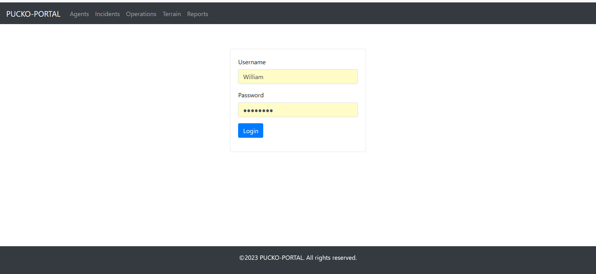
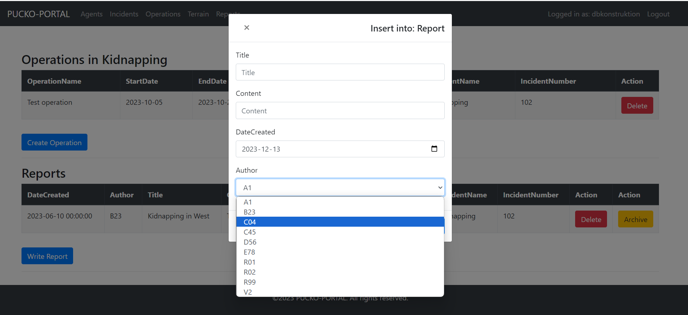

# Database Project Overview

This repository features a database project developed for an academic assignment. It showcases a web interface designed to facilitate various database operations.

## Project Features

### Login System
- **Session Management**: Checks session variables to verify user authentication and redirect appropriately.
- **Prepared Statements**: Secure handling of user credentials, leveraging MySQL users for password security.

### Data Entry Forms
- **ModalBuilder**: Streamlines the creation of data entry forms.
- **Foreign Key Handling**: Generates dropdowns for selecting values from foreign tables with composite primary keys.
- **Input Types**: Supports various data types, including text and datetime, with validation for required fields.

### Data Insertion Logic
- **Safe Data Handling**: Employs prepared statements for SQL injection prevention.
- **Error Management**: Uses exceptions to provide feedback on data insertion issues.

### Listboxes for Foreign Key Selection
- **Automated Listbox Generation**: Facilitates the selection of valid foreign key values from the database.

### Search Functionality
- **SQL Query Construction**: Builds search queries for efficient database entry retrieval.

### Content Modification Forms
- **Update Capability**: Allows for the modification of existing entries.
- **User Interaction Design**: Intuitively uses hidden fields to retain the context of user selections.

### Table Rendering
- **Interactive Tables**: Creates responsive HTML tables with `TableFactory` and `TableBuilder`.
- **Customization Options**: Adds custom buttons via callback functions for each row.

### Dynamic Table Headers
- **Automated Header Creation**: Dynamically generates table headers based on the database schema.

### Stored Procedure Execution
- **Procedure Handling**: Facilitates the execution of backend procedures through the frontend.

### Dynamic Data Manipulation Links
- **Context-Sensitive Deletion**: Enables record deletion from the UI with context-aware URLs.

### Hidden Field Utilization in Forms
- **Streamlined Data Entry**: Implements hidden fields for a simplified user experience.

### Database Connection Management
- **Singleton Pattern**: Ensures a single instance of the database connection is used application-wide.
- **Explicit Connectivity Feedback**: Clearly communicates database connection status.

_Detail_: [Database Connection Class](db/dbconnection.php "View the database connection class")

## Additional Information

- **Database Design**: Explore the database design and implementation [Database Design](src/database.md).
- **ASP.NET MVC Rewrite**: A similar project version using ASP.NET MVC is available at [MVC-database-construction](https://github.com/LindholmLabs/MVC-databaskonstruktion).
- **Paper**: The accompanying paper can be read here: [PHP_Application_Report_sv.pdf](src/PHP_Applikation_rapport.pdf).