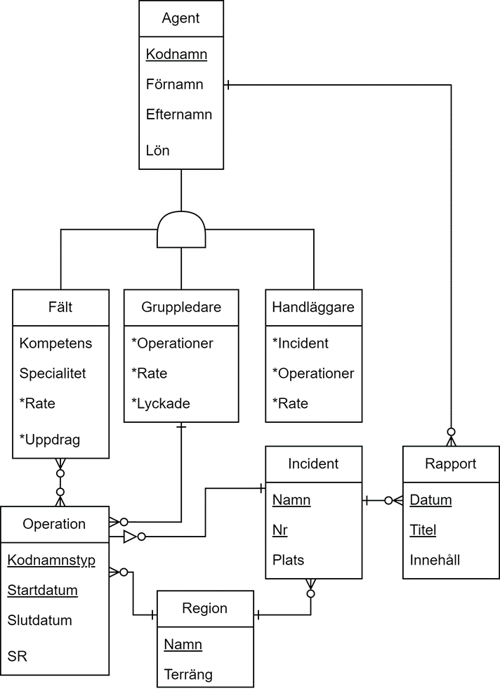

## Database Project Features

### 1. Implementation
- **Agent Relationships**: Defined relationships between agents, operations, and incidents.
- **IE Diagram**: Visual representation of agent relationships in Appendix A.
- **Database Tables**: Custom-designed tables detailed in Appendix B.

### 2. Data Types & Constraints
- **Agent Codenames**: Implemented using `CHAR(3)`.
- **Terrain Types**: Managed with `TINYINT UNSIGNED`.
- **Salaries**: Precision storage using `DECIMAL`.

### 3. Denormalization Strategies
- **Merge**: Simplified queries by merging region and incident tables.
- **Codes**: Replaced repetitive text with numeric codes in terrain table.
- **Vertical Split**: Separated reports into active and archived categories.
- **Horizontal Split**: Streamlined the agent table by isolating attributes.

### 4. Indexing
- **Purpose**: Improved query speed with indexing.
- **Types**: Primary keys, foreign keys, and composite indexes.
- **Algorithm**: Utilized `BTREE` for versatile data management.

### 5. Views
- **Report Simplification**: Unified view of all reports.
- **Field Agent Information**: Aggregated view of field agent details.
- **Agent Performance**: Displayed average success rates.

### 6. Stored Procedures
- **Functionality**: Automated data fetching, manipulation, and report archiving.
- **Security**: Implemented procedures immune to SQL injection.

### 7. Triggers
- **Logging**: Tracked changes in the agent table.
- **Cascade Delete**: Automated cleanup for deleted incidents.
- **Validation**: Ensured operational limits per region.

### 8. Rights Management
- **Roles**: Custom roles for Field Agents, Group Leaders, and Managers.
- **Administrative Control**: Comprehensive rights for database administration.

### Additional information
- **Paper**: View the accompanying academic paper here: [databaseimplementation_report_sv.pdf](A22willi_databaskonstruktion_databasimplemenetation.pdf)

### References
- [GeeksforGeeks](https://www.geeksforgeeks.org/)
- [MySQL Documentation](https://dev.mysql.com/doc/)
- [High Performance MySQL by Zawodny & Balling](https://www.oreilly.com/library/view/high-performance-mysql/0596003064/ch04.html)
- [Gustavsson's Databassystem](https://his.instructure.com/files/885449/download?download_frd=1&verifier=HwCRIQRFThPTy5ltdhXCUlaTSasvCFa2tFJTd979)

### Appendix
 - **A**:
 
 - **B**:
 > Agent(Kodnamn, Förnamn, Efternamn, Lön, Är Fält Agent, ÄrGruppLedare, Är Handläggare)
 Operation(KodnamnsTyp, Startdatum, Slutdatum, SR, Region, IncidentNamn, IncidentNr, Gruppledare)
 OpererarI (Kodnamn, Kodnamnstyp, Startdatum, Incident Namn, IncidentNr)
 Region(Namn, Terräng)
 Incident(Namn, Nr, Plats, Region)
 Rapport(Datum, Titel, Innehåll, For fattare, IncidentNamn, IncidentNr)